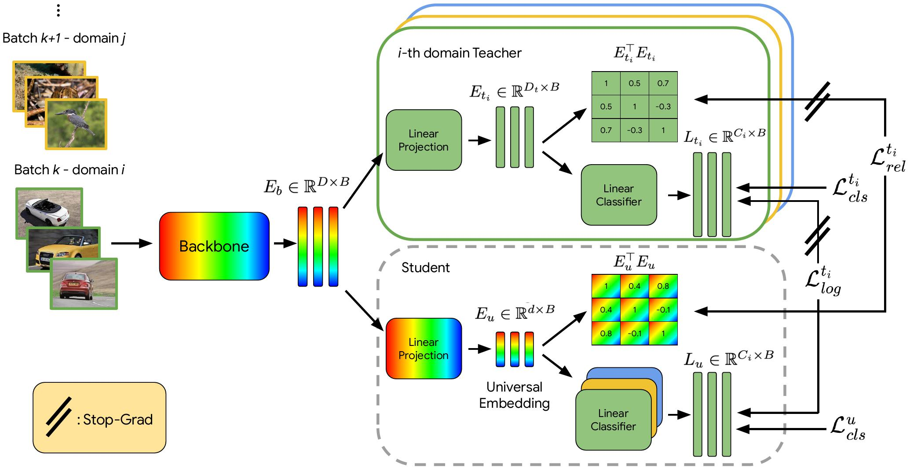

# Official Repository for the paper: <br /> UDON: Universal Dynamic Online distillatioN for generic image representations


This repository contains the official implementation of the **NeurIPS '24** paper [UDON: Universal Dynamic Online distillatioN for generic image representations](https://arxiv.org/abs/2406.08332).
It currently supports the training of universal embeddings on the UnED dataset with the UDON training pipeline, as well as evaluation on the UnED test set.
The implementation builds upon the codebase of the [UnED repository](https://github.com/nikosips/Universal-Image-Embeddings), which relies on the [Scenic](https://github.com/google-research/scenic) computer vision library, which is based on [JAX](https://github.com/google/jax) and [Flax](https://github.com/google/flax).





## Requirements

The ```setup.sh``` script contains a reference setup of a Google Cloud TPU VM in order to run the code in this repository. In order to use on other accelerators (e.g. GPU), please alter lines ```11,12``` to the respective [jax installation](https://github.com/google/jax?tab=readme-ov-file#instructions).


## Dataset and initial checkpoints preparation

We follow the exact guidelines for the data preparation of the [UnED repository](https://github.com/nikosips/Universal-Image-Embeddings). We repeat them below.

The UnED dataset consists of 8 existing datasets, with new splits proposed.
We provide guidelines for how to prepare all the data that are used for training and evaluation.

*  Create ```data``` directory inside the "Universal-Image-Embeddings" directory.

* Download the splits of UnED (info files) (https://cmp.felk.cvut.cz/univ_emb/info_files.zip) and extract it inside the data directory.

* Download (https://cmp.felk.cvut.cz/univ_emb/#dataset) and extract images for each one of the datasets comprising UnED, into ```data/images``` directory.
You should follow the URL provided for each one of the datasets, in order to get the images of it.
If you encounter any problems downloading any of the datasets from their original sources that we have linked, please contact us in order to help you. 
```data/images``` directory should end up with the following structure (should contain the directories as shown below in order to work with the info files provided later):

  ```
  ├── images
  │   ├── cars
  │   │   └── car_ims
  │   ├── food2k
  │   │   └── Food2k_complete
  │   ├── gldv2
  │   │   ├── images
  │   │   │   ├── index
  │   │   │   ├── test
  │   │   │   └── train
  │   ├── inat
  │   │   ├── iNaturalist
  │   │   │   └── train_val2018
  │   ├── deepfashion
  │   │   ├── inshop
  │   │   │   └── img
  │   ├── met
  │   │   ├── MET
  │   │   ├── test_met
  │   │   ├── test_noart
  │   │   └── test_other
  │   ├── rp2k
  │   │   ├── all
  │   │   │   ├── test
  │   │   │   └── train
  │   └── sop
  │       ├── chair_final
  │       └── ...
  ```

* Download the checkpoints that are used as a starting point for the finetuning (https://cmp.felk.cvut.cz/univ_emb/#checkpoints) and place them inside the ```models``` directory, by running the following command:


  ```
  bash download_models.sh
  ```

* Create the tfds records that are used to load the data for training and evaluation by running the following command:


  ```
  bash prepare_data.sh
  ```


In the end, data folder should look like this:

```
├── Universal-Image-Embeddings
│   ├── data
│   │   ├── images
│   │   ├── info_files
│   │   ├── models
│   │   └── tfds
```

## Training and evaluation on the UnED dataset

Now that the data are ready, you are ready to train and evaluate embeddings on the UnED dataset.

* <b>Embedding training and validation (and optional final testing)</b>

  Configure the "config_train_vit.py" to the type of training you want to perform.
  Checkpoints, embeddings and event files are saved in ```YOUR_WORKDIR```.
  Wandb flags are optional if you want to log training and validation metrics to 
  wandb, otherwise, you can view them in tensorboard, through the event file
  that is saved in the workdir.

  ```
  python -m universal_embedding.main \
  --config=universal_embedding/udon_configs/config_train_vit.py \
  --workdir=[YOUR_WORKDIR] \
  --config.eval_dataset_dir=data/tfds \
  --config.train_dataset_dir=data/tfds \
  --config.info_files_dir=data/info_files \
  --wandb_project [WANDB PROJECT NAME] \
  --wandb_group [WANDB GROUP NAME] \
  --wandb_entity [WANDB ENTITY NAME] \
  --wandb_name [WANDB EXPERIMENT NAME] \
  --use_wandb 
  ```

* <b>Evaluation of embeddings trained with this repository</b>

  Configure the "config_knn_vit.py" to the type of evaluation you want to perform.
  Configure config.train_dir in the config file to the directory that the checkpoint of the training is saved (the config.json of the training must also exist there).
  Descriptors and event files are saved in ```YOUR_WORKDIR```.

  ```
  python -m universal_embedding.knn_main \
  --config=universal_embedding/configs/config_knn_vit.py \
  --workdir=[YOUR_WORKDIR] \
  --config.eval_dataset_dir=data/tfds \
  --config.train_dataset_dir=data/tfds \
  --config.info_files_dir=data/info_files \
  --config.train_dir=[MODEL TRAIN DIR]
  ```

- - - -

## Trained checkpoints

We provide some trained checkpoints with the UDON method

* [CLIP pretrained UDON checkpoint](https://cmp.felk.cvut.cz/univ_emb/finetuned_checkpoints/clip_uscrr_iccv_jax_checkpoint)

## State of repository

The repository is currently under update and more features will be coming soon.
Soon, UDON checkpoints will be released.


## TODO

- Soon, UDON checkpoints will be released.
- Add descriptor extraction for an ImageDir dataset with pretrained UDON models

## Citation

If you use our work in yours, please cite us using the following:

```
@article{ypsilantis2024udon,
  title={UDON: Universal Dynamic Online distillatioN for generic image representations},
  author={Ypsilantis, Nikolaos-Antonios and Chen, Kaifeng and Araujo, Andr{\'e} and Chum, Ond{\v{r}}ej},
  journal={arXiv preprint arXiv:2406.08332},
  year={2024}
}
```

- - - -